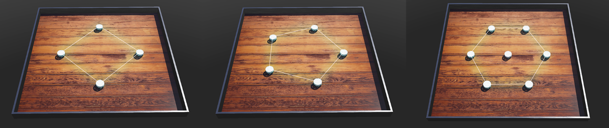

# CADT-UH 1038 - Autonomous and Social Robots 

## Final Term Project - Simple Pattern Formation of a Robot Swarm

By Pi Ko and  Maryam Alremeithi

### About

This is a robotic simulation project we did for the class CADT-UH 1038 - Autonomous and Social Robots for the following problem.

**Problem :** *Given an integer N by a human, form an N-side regular polygon formation on the ground using a swarm of robots. Robots must communicate with each other and get to the vertices of the polygon autonomously, without human intervention.*

### Platform

The simulation is done in [Webots robot simulator](https://cyberbotics.com).
All controller codes are written in C.

### Running

To run, clone the entire repository and open the world "SimpleSwarm.wbt" in the worlds folder, then enter an integer between 3 to 9.

